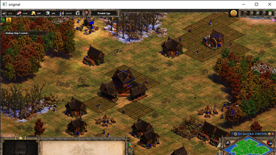
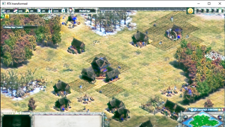
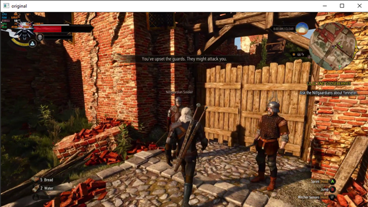
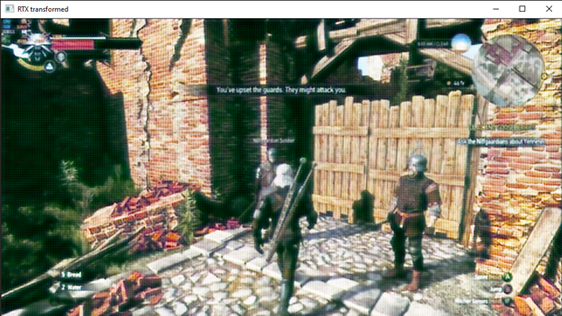

# CYCLE GAN

This is an example of a Cycle GAN that has been used for a variety of tasks:

One exmaple is going from game footage with no ray tracing to attempting to simulate ray tracing

Another example is to try and estimate depth from images.

### USE CASE 1: Evaluating Depth from RGB - > RGBD Images

Methods Used and Results :

Initially, the image data is stored in the directory and then read using OpenCV, which seems to be the only package that supports the files directly, then the OpenCV image matrices are then read into the Training and Testing samples as TrainX and the depth samples as TrainY.

The CNN has a stride of 1 and whenever any convolution is done with a greater stride, the effect is reverted using some upsampling layers.

The depth maps thus obtained are to be used in a python module called Open3D to create point clouds.

This must be due to the type of files used in the dataset, which are very hard to comprehend, instead of the traditional png or jpeg images, the images used in the dataset are .ppm and .pgm, this makes most of the file readers provided with most of the packages not work with the files. I am still attempting to transform the data to a form that can be read by the device.
The data will be rendered using pyrender or OpenGL.

The Data observed can be found in the folder : 

[Power point](PointCloud/Plane Detection from Monocular Images.pptx)

[Video Presentation](PointCloud/Pointcloud.mkv)

### USE CASE 2 : Transforming non RTX Images to RTX Imagery

Two Generators and Discriminators work in tandem to train each other, to convert the images from Non Ray Traced to Ray traced image space.

The Dataset consists of frames picked from multiple playthrough recordings, with totaling approximately 16,000 images of each type ( Ray Traced and Non ray traced ).

The generator consists of three main parts, the initial block or downsampling block, the residual block or the Resnet Transformer block and lastly the upsampling block.

The discriminator on the other hand is a simple binary classifier that is used to identify if a given image belongs to one class or the other.

The complete model is a combination of two such generators and two such discriminators.

Current Model statistics :

Training : 400 epochs, Batch size = 1, number of batches = 100

Sample :

!

Output:

Sample 2 :

Output :

